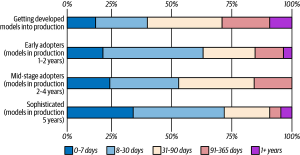
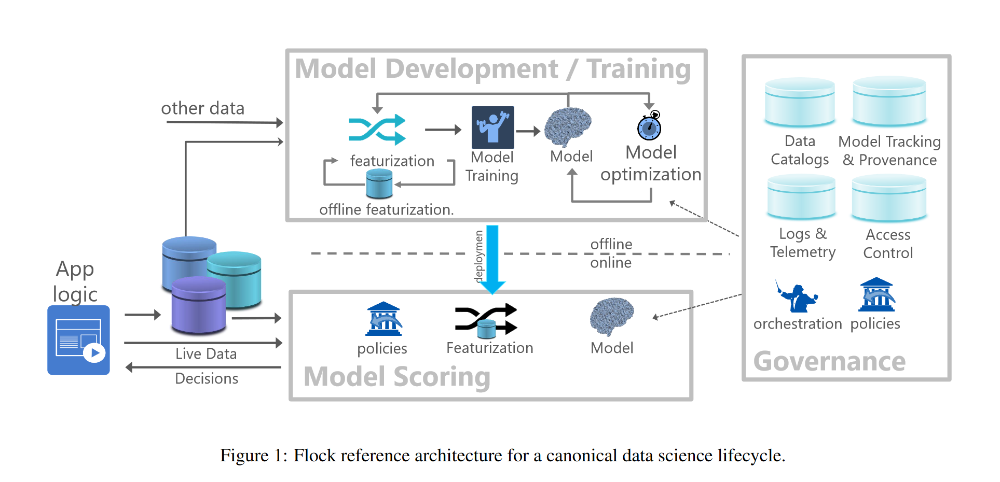

# Production: Introduction to ML Systems

```code
$ echo "Data Sciences Institute"
```
---

# Introduction

---

## Agenda

- **1.1 Overview of ML Systems**
    - When to Use ML
    - ML in Production
    - ML vs Traditional Software
- **1.2 Introduction to ML System Design**
    - Business and ML Objectives
    - Requirements of Data-Driven Products
    - Iterative Process
    - Framing ML Problems 

---

## Agenda

- **1.3 Project Setup**
    - Introduction.
    - Repo File Structure.
    - Git, authorisation, and production pipelines.
    - VS Code and Git.
    - Python virtual environments.
    - Branching Strategies.
    - Commit Messages.

---

## About

- These notes are based on Chapters 1 and 2 of [*Designing Machine Learning Systems*](https://huyenchip.com/books/), by [Chip Huyen](https://huyenchip.com/).


---

# Machine Learning

---

## ML: An Illustration


---

## ML: An Illustration


---

## What is Machine Learning (ML)?

> “A computer program is said to learn from experience *E* with respect to some class of tasks *T* and performance measure *P*, if its performance at tasks in *T*, as measured by *P*, improves with experience *E*.” (Mitchel, 1997)


> "Machine learning is an approach to (1) learn (2) complex patterns from (3) existing data and use these patterns to make (4) predictions on (5) unseen data." (Huyen, 2022)

---

## What is Machine Learning (ML)?

ML is a collection of methods that allow a computer to:

- **Learn autonomously** to perform a task based on a set of examples and without being explicitly programmed to perform the task.
- **Gain from experience** such that the method performs better in the measure that it observes additional examples.
- **Generalize results** beyond the data used for training the method.

---

## Why Use Machine Learning?

- ML is used when a task is too complex or impractical to program explicitly.
- When applied successfully, ML will enable
    - Greater scale: automation.
    - Better performance.
    - Doing things that were not possible before.

- ([Image Source](https://www.augmentedstartups.com/blog/overcoming-challenges-in-object-detection-accuracy-speed-and-scalability))


---

## When to Use ML?

- A business problem is not the same as an ML problem.
    - The objective of a business is generally concerned with profit maximisation: increasing sales, cutting costs, enhancing customer satisfaction, reducing churn, increasing time on the website, etc.
    - The objective of an ML method is to enhance the performance of the task, given more data.
- Optimising ML performance metrics does not automatically translate to optimising business performance.
- Some of the most popular business applications of ML are in areas where business and ML performance overlap: fraud detection, recommender systems, etc.

---

# ML System Design

---

## Characteristics of ML Use Cases (1/4)

### Learning is involved

- The system can learn autonomously.
- Given a series of inputs, the system learns how to produce outputs. 
- Not every ML model can learn any hypothesis; more complex models will tend to be more flexible.

### Complex patterns

- There are patterns to learn, and they are complex.
- ML solutions are only helpful if there are patterns.
- An ML model can learn simple patterns, but the cost of applying ML may be unreasonable.
    
---

## Characteristics of ML Use Cases (2/4)

### Existing data

- Data is available, or it is possible to collect data.
- Out-of-domain predictions may fail because of a lack of training data.
- Online (real-time) learning systems could be deployed and trained using production data.

### Predictions

- ML algorithms will generate predictions. Therefore, the problem to solve should be predictive.
- A prediction could be about a future event (forecast) or an event that is difficult to observe (e.g., fraud detection or clustering).

---

## Characteristics of ML Use Cases (3/4)

### Unseen data

- Unseen data shares patterns with the training data.
- The learning method generalises reasonably well on testing data.

### It is repetitive

- ML algorithms perform better with experience: repetitive tasks afford such experience.

### The cost of incorrect predictions is low

- Achieving perfect performance may not be possible.
- Human-level performance or better could be achieved.

---

## Characteristics of ML Use Cases (4/4)

### It is at scale

- Upfront costs are involved: infrastructure, staff, DevOps.
- Setting up an ML system that caters to many ML models concurrently.

### Patterns are constantly changing

- Hard-coded solutions can become stale and outdated.
- The ML system's environment changes: economics, social behaviour, trends, etc.
- Feedback: the ML system informs a company's actions, affecting, in turn, the company's interactions with the external environment.

---

## ML Systems Design

- ML methods are not ML systems: the learning method needs to be applied to data, assessed, tuned, deployed, governed, and so on.
- ML system design is a system approach to MLOps, i.e., we will consider the system holistically, including
    - Business requirements.
    - Data stack.
    - Infrastructure.
    - Deployment.
    - Monitoring.

---

## ML Systems Design

- MLOps:  a set of tools and best practices for bringing ML into production. 
- Image: (Sculley, 2015)


---

# How is ML in Production Different?

---

## ML in Research vs Production

|Dimension|Research|Production
|---------|--------|----------|
|Requirements|State-of-the-art model performance on benchmark datasets|Different stakeholders have different requirements|
|Computational priority|Fast training, high throughput|Fast inference, low latency|
|Data|Static|Constantly shifting|
|Fairness|Often not a focus|Must be considered|
|Interpretability|Often not a focus|Must be considered|

---

## Business and ML Objectives (1/5)

### Different stakeholders require different things

- ML engineers: increase performance or efficiency of recommender system.
- Sales: recommend more profitable options.
- Product: reduce latency.
- Platform: stability.
- Manager: control costs.

---

## Business and ML Objectives (2/5)

### Computational priorities during model development        

- Training is the bottleneck.
- Throughput, the number of cases processed, should be maximised. 

---

## Business and ML Objectives (3/5)
### Computational priorities in production

- Fast inference is desirable.
- Latency, the time between when a query is received and when it is addressed, should be minimised.
- Latency is usually measured using percentiles of time elapsed (e.g., 99th percentile should be below X ms.)


---

## Business and ML Objectives (4/5)

### Data

- Data quality.
- Historical vs constantly generated data.

### Fairness

- Fair and ethical decision-making is a key requirement.
- ML algorithms make predictions based on encodings of past observations: they can perpetuate the biases in the data and more.

---

## Business and ML Objectives (5/5)

### Explainability

- Trust.
- Legal requirements.
- Informativeness: Besides predictions, we require feature importance and other information about our results.
- Transferrability: Can learning from a scenario be applied to other scenarios?

---

# Requirements of ML Systems

---

## Lead Time to Production


(Huyen, 2022)

---

## Designing Data-Intensive Applications

- Many applications today are data-intensive instead of compute-intensive.
    - The limiting factor is data and not computation.
    - Concerns: the amount of data, the complexity of data, and the speed at which it changes.
- ML Systems tend to be embedded in data-intensive applications.
- (Kleppmann, 2017)


---

## Fundamental Requirements of ML Systems (1/2)

- **Reliability**: The system should continue to perform the correct function at the desired level of performance, even in the face of adversity.

    - May require reporting uncertainty of results.
    - Remove "silent failures": The system should alert the users to unexpected conditions.
    - If all else fails, shut down gracefully (e.g., close connections, log errors, alert downstream processes, etc.) 

- **Scalability**: To ensure the possibility of growth.

    - Increase complexity.
    - Traffic volume or throughput.
    - Model count.

---

## Fundamental Requirements of ML Systems (2/2)

- **Maintainability**: To allow different contributors to work 
productively on the same system.

    - Maintain existing capacities.
    - Expand to new use cases.

- **Adaptability**: To shifting data distributions and business requirements.

    - The system should allow for the discovery of aspects for performance improvements.
    - Allow updates without service interruptions.

---

# ML System Design: An Iterative Process

---

## Developing ML Systems


Have things changed that much? (Huyen, 2022) and [CRISP-DM (c. 1999)](https://www.datascience-pm.com/crisp-dm-2/)

---

## Framing ML Problems

- The output of an ML model dictates the type of ML problem.
- In general, there are two types of ML tasks
    - Classification.
    - Regression.    

- A regression model can be framed as a classification model and vice versa.
    - Regression to classification: apply quantisation.
    - Classification to regression: predict the likelihood of a class.
    
---

## Framing ML Problems (1/2)

### Binary Classification
- Two classes. 
- Simplest classification problems

### Multiclass Classification

- More than two (mutually exclusive) classes.
- High cardinality (number of classes) problems will be more complex than low cardinality problems.
- High cardinality can be addressed with a hierarchical classification approach: first, classify into large groups, then classify into specific labels.
---

## Framing ML Problems (2/2)

### Multilabel Classification

- An observation can have more than one label.
- One approach is to treat the problem as multiclass by creating unique labels out of combinations of individual labels.
- Another approach is one-vs-rest, where each label is treated with a different binary classification model.

---

## Objective Functions (1/2)

- ML requires an objective function to guide the learning process through optimisation. 
- In the context of ML:
    
    - Regression tasks generally employ error metrics: Root Mean Square Error (RMSE) or Mean Absolute Error (MAE).
    - Classification tasks are generally performed using log loss or cross-entropy.
---

## Objective Functions (2/2)

- Log loss or cross-entropy loss is a performance metric that quantifies the difference between predicted and actual probabilities. 
- In a two-class setting, it is given by
 
 $$
 H(y, p)=-\frac{1}{N}\sum_{i=1}^{n}\left(y_i ln(\hat{p}_{i}) +(1-y_{i})ln(1-\hat{p}_{i})\right)
 $$

- Formulation is related to maximum likelihood: minimising negative log-likelihood is the "same" as minimising log loss.

---

## Objective Functions

- Assume the actual value is 1.
- If the model is confident and correctly predicted 0.9, then 

```
Loss = -(1*ln(0.9)) = 0.1054

```

- If the model is unsure and predicts 0.5, then 

```
Loss = -(1*ln(0.5)) = 0.6932
```

- If the model is confident but incorrectly predicted 0.1, then 
```
Loss = -(1*ln(0.1)) = 2.3026
```

---

# Our Reference Architecture

---

## The Flock Reference Architecture


* Agrawal et al (2019)

---

# References

---

## References (1/2)

- Agrawal, A. et al. "Cloudy with high chance of DBMS: A 10-year prediction for Enterprise-Grade ML." arXiv preprint arXiv:1909.00084 (2019).
- Huyen, Chip. "Designing machine learning systems." O'Reilly Media, Inc.(2022).
- Kleppmann, M. "Designing data-intensive applications: The big ideas behind reliable, scalable, and maintainable systems." O'Reilly Media, Inc. (2017).
- Mitchell, Tom M. "Machine learning." (1997).

---

## References (2/2)

- Olah, C. "Conv Nets: A Modular Perspective." (2014) [URL](https://colah.github.io/posts/2014-07-Conv-Nets-Modular/)
- Sculley, D. et al. "Hidden technical debt in machine learning systems." Advances in neural information processing systems 28 (2015).
- Wirth, R. and J. Hipp. "CRISP-DM: Towards a standard process model for data mining." Proceedings of the 4th international conference on the practical applications of knowledge discovery and data mining. Vol. 1. (2000).