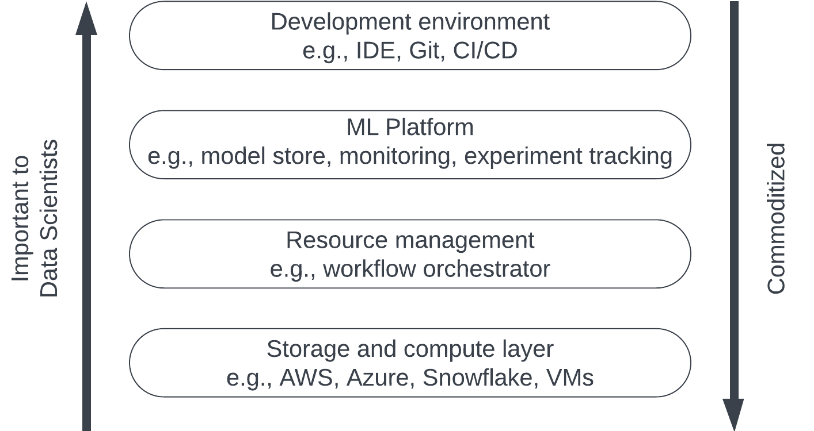

# Production: Infrastructure and Organization

```code
$ echo "Data Science Institute"
```
---

# Agenda

**8.1. Infrastructure for ML**

- Infrastructure
- Storage and Compute
- Development Environments
- Resource Management

**Topic 8.2. The Human Side of ML**

- Roles, Tasks, and Skills
- Where to Focus our Efforts?

---

# Infrastructure

---

# What is Infrastructure?

- Infrastructure supports the development and maintenance of ML systems through four key layers:
   1. Storage and compute for data collection and ML workloads
   2. Resource management for workload scheduling and orchestration
   3. ML Platform with tools for ML application development
   4. Development environment for coding and running experiments.



<!-- (Adapted from Huyen, 2021) -->

---

# Infrastructure Investment Grows with Scale


<!-- (Adapted from Huyen, 2021) -->

---

# Storage and Compute

- ML systems require and produce a lot of data.
- Storage layer can be HDD or SDD, but can also be blob (binary large object) storage.
- Over the last decade, storage has been commoditized in the cloud.

---

# Storage and Compute

- Compute layer can be sliced into smaller compute units: instead of a large job, some jobs can be partitioned and computed with a distributed cluster of processors.
- Compute can be permanent or ephemeral: 
    - Training has spiky compute requirements that tend to be ephemeral.
    - DB will require some compute to operate and, generally, this compute is permanent.
- Compute and storage can scale: cloud infrastructure is attractive for its elasticity (it grows with needs.)
- Compute must have access to storage, therefore, it is important to consider the cost of data transmission.

---

# Development Environment

- Where ML engineers write code, run experiments, and interact with the production environment.
- Consists of IDE, versioning, and CI/CD.
- Dev environment setup should contain all the tools that can make it easier for engineers to do their job.

---

# Development Environment

- Versioning is fundamental for ML System implementation. 
- Dev environment should be built for CI/CD:
    - Automated testing.
    - Continuous integration.
    - Andon Cord: capability to revert to latest working verison of system.
- Dev Environment should ressemble the production environment as closely as possible.

---

# Resource Management

- In terrestrial data centres, storage and compute are finite.
- With cloud infrastructure, storage and compute are elastic, but they are charged by utilization.
- Two key characteristics to consider:
    - Repetitiveness.
    - Dependencies.


<!-- Tasks can be organized in Directed Acyclical Graphs (DAGs) using orchestrators (Huyen, 2021) -->

---

# The Human Side of ML

---

# Roles, Tasks, and Skills

- CDO/DS Leader: 
    - Bridges the gap between business and datas science.
    - Defines the vision and technical lead. 
    - Skills: leadership, design thinking, data science/ML, domain experience.
- Data engineer:
    - Implement, test, and maintain infrastructural components for data management.
    - Define data models and systems architecture.
    - Skills: SQL/NoSQL, Hive/Pig/HDFS, Python, Scala/Spark.

---

# Roles, Tasks, and Skills

- Analyst:
    - Collects, cleans, transforms data.
    - Interprets analytical results, reports and communicates.
    - Skills: R, Python, SQL, BI Tools.
- Visualization Engineer
    - Makes sense of data and analysis output by showing it in the right context.
    - Articulate business problems and display solutions with data.
    - Skills: design thinking, BI Tools, presentation and writing.

---

# Roles, Tasks, and Skills (cont.)

- Data Scientist
    - Solves business tasks using ML and data.
    - Data preparation, training, and evaluating models.
    - Skills: R, Python, modelling, data manipulation.
- ML Engineer
    - Combines software engineering and modeling to implement data intensive products.
    - Deploys models into production and at scale.
    - Python, Spark, Julia, MLOps, DevOps, CI/CD.

---

# Roles, Tasks, and Skills

- Subject Matter Expert
    - Applies rigorous methods developed in area of expertise.
    - Help decision-makers come to conclusions safely beyond ML models.
    - Ex: Statistician, Actuary, Econometrician, Physicist, Epidemiologist
- Model validation
    - Independently validate models, including their interpretation.
    - Perform technical testing.
    - Skills: similar to data scientis/SME.

---

# Where to Focus Our Efforts?


<!-- (Aggrawal et al. 2020) -->

Start with the data:

- Mature proprietary solutions have stronger support for data management.
- Providing complete and useable thrid-party solutions is non-trivial.
- There is no data analysis without data.

---

# Where to Focus Our Efforts?


<!-- (Aggrawal et al. 2020) -->

Then, focus on serving and deployment:

- Consider self-service approaches.
- Automate, automate, and automate.

---

# References

- Agrawal, A. et al. "Cloudy with a high chance of DBMS: A 10-year prediction for Enterprise-Grade ML." arXiv preprint arXiv:1909.00084 (2019).
- Huyen, Chip. "Designing machine learning systems." O'Reilly Media, Inc.(2022).