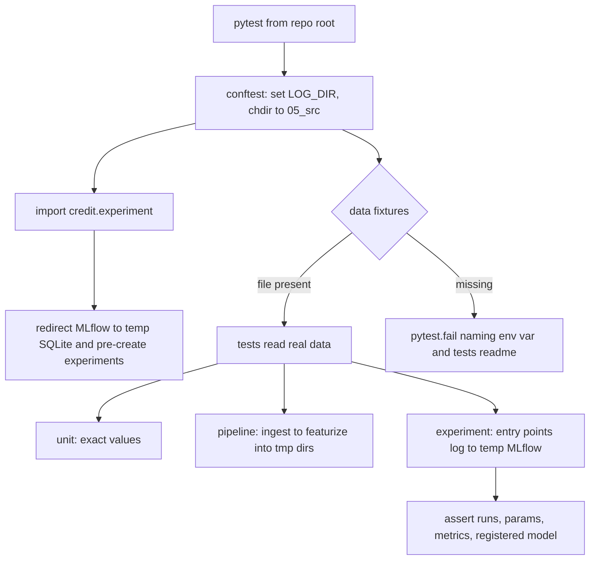

# Source Test Suite - Plan

## Goal Capsule

- **Objective:** The instructor can change any code in `05_src/credit`, `05_src/stock_prices`, or `05_src/utils` and know from one local command whether the data pipelines still produce correct data and every credit experiment still runs end to end and logs what it should. Students can read the same suite as a worked example of testing an ML system.
- **Means:** A pytest suite under `05_src/tests/`, grouped by module and tagged by layer, with one shared harness that isolates MLflow, logs, and pipeline outputs (KTD1–KTD5).
- **Product authority:** Jesús Calderón (Technical Facilitator, course author). The Product Contract wins over the Planning Contract; the Planning Contract wins over unit-level detail.
- **Stop conditions:** Stop and ask if a fix would change a model's documented behaviour beyond the defects named here, or if the full suite cannot be made to run in roughly 15 minutes without dropping below the minimum knobs in KTD7.
- **Open blockers:** None.
- **Product Contract preservation:** Product Contract unchanged; Outstanding Questions resolved in place by KTD1–KTD7.

---

## Product Contract

### Summary

A pytest suite for `credit`, `stock_prices`, and `utils`, grouped by source module and tagged by layer (unit, pipeline, experiment). It runs locally against the real credit and price data. Experiments execute through their real entry points with shrunk settings against a throwaway MLflow store. Defects the tests expose are fixed in the same work.

### Problem Frame

The three source packages have no tests. `pytest` is not installed, although `.claude/CLAUDE.md` tells contributors to run it. The code is changed every cohort: for example, #183 fixed a refit bug in the linear Optuna search that nothing would have caught automatically. Some defects are silent. In `DataManager.create_features`, the lag is shifted on the unsorted group and then assigned onto the date-sorted frame. Its docstring says the lag is chronological, but that holds only if the rows already happen to be in date order. A smoke test (`assert len(features) > 0`) passes either way, so the suite has to check exact values.

### Key Decisions

- **Real data, local only; no CI and no checked-in fixtures.** Higher fidelity for a course whose point is real pipelines; the cost is that a fresh clone cannot run the data-dependent layers. (session-settled: user-directed — chosen over a self-contained fixture suite in GitHub Actions and over a two-tier suite: fidelity to the real data matters more than CI.) Governs R5, R6.
- **Missing data fails loudly; it never skips.** A partial green run would mislead students about whether their setup works. (session-settled: user-directed — chosen over skip-with-reason: no false "all green".) Governs R6.
- **MLflow logs to a per-session temporary store, not the Docker server.** Keeps the class experiments and Model Registry clean and needs no Docker. Because the store is isolated, the experiment and model names hardcoded in `single_run` and `grid_search` need no source change. (session-settled: user-approved — chosen over the real server and skip-if-down: isolation and no Docker dependency.) Governs R7, R16.
- **Experiments run through their real entry points on the full credit data, with shrunk settings.** This exercises the code students run, not a re-implementation. (session-settled: user-directed — chosen over row subsampling and full-default slow runs.) Governs R16.
- **Bugs found are fixed in this work.** Tests describe correct behaviour, so this change is not test-only. (session-settled: user-directed — chosen over strict xfail and over asking per bug.) Governs R19.
- **Organize by source module, with a layer marker on each test.** A maintainer editing a module finds its tests in one place; the markers and the tests readme carry the layering lesson. (session-settled: user-directed — chosen over top-level layer folders and over also running the readme examples as tests.) Governs R3, R4.
- **The tests are also teaching material.** Names, assertions, and the tests readme are written to be read by students. (session-settled: user-directed — chosen over a maintainer-only safety net.) Governs R20, R21.
- **Setup and data notes live only in the tests readme.** `SETUP.md` and the module readmes are not used for test setup notes. (session-settled: user-directed — chosen over also updating `SETUP.md`.) Governs R20.

### Requirements

**Foundation**

- R1. `uv run python -m pytest`, run from the repo root, runs the whole suite as `.claude/CLAUDE.md` describes; pytest is a declared dev dependency.
- R2. Tests always import the local `credit`, `stock_prices`, and `utils` packages, never same-named packages installed from PyPI.
- R3. Every test carries exactly one layer marker (`unit`, `pipeline`, or `experiment`), and each layer can be run on its own.
- R4. Tests are grouped by source module, mirroring `credit`, `stock_prices`, and `utils`.

**Data and environment**

- R5. Data-dependent tests read the real Give Me Some Credit training CSV and the real price CSVs from the locations the project `.env` configures.
- R6. When a required data file or environment variable is missing, the run fails with a message that names what is missing and points to the tests readme.
- R7. No test writes to the real price, features, or MLflow locations; every output goes to a per-session temporary location that is cleaned up.

**Unit layer**

- R8. `utils.logger.get_logger`: creates the log directory, attaches one file handler and one stream handler, adds no duplicate handlers on repeat calls with the same name, applies the requested level, and writes records in the documented file format.
- R9. `credit.data.load_data`: on the real file, drops the index column, renames every column to the documented snake_case names, coerces non-numeric values to NaN, and returns X without `delinquency` and Y as the binary target.
- R10. The `credit.logistic` and `credit.linear` pipelines: each branch routes the documented columns and produces exact expected values on small hand-built inputs (clipping bounds, `log1p`, median imputation, missing indicators kept unscaled). Each pipeline also fits and returns valid probabilities on the real data.
- R11. `exp__linear_hyperopt.suggest_params` returns the exact solver and `l1_ratio` mapping for each penalty branch.
- R12. `credit.experiment.run_cv`: logs the given parameters, logs mean CV metrics equal to what cross-validation computes, honours `nested`, logs and registers a model only when `log_model` is true, and reuses an existing experiment instead of creating a duplicate.
- R13. `DataManager` helpers: ticker and source columns are derived from the file name, dates are parsed, sampling is deterministic for a fixed seed and keeps every file when `n_sample` exceeds the file count, and partitions are written as one dataset per ticker and year.

**Pipeline layer**

- R14. The stock-price ingest → featurize flow runs end to end on a fixed-seed sample of real price CSVs. It writes partitions with no rows lost or duplicated and features with the documented schema.
- R15. For each ticker, `Close_lag_1` equals the previous trading date's close, `Returns` equals `Close / Close_lag_1 - 1`, and the first date has no lag. This must hold even when input rows arrive out of date order.

**Experiment layer**

- R16. Each of the four credit experiment entry points (`single_run`, `grid_search`, `hyperparam_opt`, `linear_search`) runs to completion on the full real credit data with the fewest folds and trials that still exercise its logic.
- R17. After each experiment run, the MLflow store holds the expected experiment, parent and child run structure, logged parameters, and finite metrics within valid ranges. Where the experiment registers a model, that registered model loads and returns probabilities for the credit feature matrix.
- R18. For `linear_search`, the registered model's parameters equal the best trial's full parameter set, including the derived solver and `l1_ratio` (the regression covered by #183).

**Defects and documentation**

- R19. Each defect a test exposes is fixed in this work. The exposing test stays as a regression guard. If a fix changes documented behaviour, the module readme and docstring change too; the `create_features` docstring is the first expected case.
- R20. A tests readme explains the three layers and their markers, how to run each layer, and the expected runtime. It also lists the data files and `.env` variables required and where to obtain the credit and price data, and records the local-versus-installed `utils` import pitfall.
- R21. Each test name states the behaviour it checks. Assertions compare against exact expected values (`pytest.approx` for floats) wherever an exact value is computable; a bare `> 0` style check counts as a defect.

### Acceptance Examples

- AE1. **Covers R6.** **Given** `CREDIT_DATA` is unset or points to a missing file, **when** the suite runs, **then** the credit tests fail with a message naming `CREDIT_DATA` and the tests readme; they do not skip.
- AE2. **Covers R15.** **Given** a ticker whose price rows are stored in shuffled date order, **when** features are created, **then** each row's `Close_lag_1` is the close of the immediately preceding date, and `Returns` matches to floating-point tolerance.
- AE3. **Covers R8.** **Given** `get_logger("x")` has already been called, **when** it is called again with the same name, **then** the logger still has exactly two handlers.
- AE4. **Covers R7, R17.** **Given** the class MLflow server is not running, **when** the experiment layer runs, **then** all four experiments pass and nothing is written to the server or to `05_src/data`.
- AE5. **Covers R18.** **Given** a `linear_search` run whose best trial used the l1 penalty, **when** the registered model is loaded, **then** its classifier uses `saga` and `l1_ratio == 1.0`.

### Success Criteria

- The full suite passes locally on the instructor's machine with the real data present.
- Re-introducing either known defect (the unsorted lag, or the #183 l1 refit bug) makes at least one test fail.
- A student who reads only the tests readme can set up the data and `.env` and run each layer.

### Scope Boundaries

- No GitHub Actions or other CI job runs the suite.
- No synthetic or checked-in fixture datasets stand in for the real data; small hand-built frames inside unit tests are allowed for exact-value checks.
- No full-default experiment runs (50 trials × 5 folds).
- `05_src/experiment_tracking/` and the notebooks are not covered.
- `SETUP.md` is not changed; setup notes go only in the tests readme (R20).
- The readme code examples are not executed as tests.

### Dependencies / Assumptions

- The real credit CSV (`05_src/data/credit/cs-training.csv`) and the price CSVs (`05_src/data/prices_csv/`) are present locally and gitignored.
- Assumption: a full local run, with the experiment layer included, finishes in roughly 15 minutes or less. `grid_search` has a fixed 24-combination grid and no trial setting, so its only shrinkable knob is folds.

### Outstanding Questions

**Deferred to Implementation**

- Where the price CSVs originally come from, so R20 can document it; the repo does not say. If it cannot be determined from the course materials, the tests readme says so and asks the reader to use the files distributed with the course.
- Whether pandas 3.0.6 already breaks `DataManager.create_features` / `save_features` (the Dask `meta` and schema assume `object` strings). U5's pipeline test will show it; any break is fixed under R19.

### Sources / Research

- `05_src/stock_prices/data_manager.py` — `create_features` shifts on the unsorted group, then assigns onto the sorted frame (lag defect).
- `05_src/credit/experiment.py` — import-time `load_dotenv(override=True)` and `mlflow.set_tracking_uri`.
- `05_src/credit/exp__logistic_simple.py`, `05_src/credit/exp__logistic_grid_search.py` — experiment names are hardcoded; `exp__logistic_hyperopt.hyperparam_opt` (`max_evals`) and `exp__linear_hyperopt.linear_search` (`n_trials`) accept name overrides.
- `pyproject.toml` — no pytest dependency or configuration; lists PyPI `utils` (installed, real package without `logger.py`) and `credit` (empty placeholder).
- `.github/workflows/automatic_pr_comment.yaml` — the only workflow; runs no tests.
- `05_src/.env` — every data path is relative (`../05_src/data/...`, `LOG_DIR=../07_logs/`), so it resolves correctly only when the working directory is `05_src`.
- `05_src/utils/readme.md` — says the stream handler writes to stdout; `logging.StreamHandler()` defaults to stderr.
- `01_materials/labs/01_setup.ipynb` — notebooks already use `sys.path.insert(0, ...)` so the local `utils` wins over the PyPI package.
- Installed versions: mlflow 3.16.1, pandas 3.0.6, dask 2026.8.0, scikit-learn 1.9.1, optuna 5.0.0.

---

## Planning Contract

### Key Technical Decisions

- KTD1. **Tests live in `05_src/tests/`, mirroring the source packages (`credit/`, `stock_prices/`, `utils/`), with pytest configured in `pyproject.toml`.** Keeps tests beside the code and inside the `05_src` working-directory convention the `.env` paths assume; `uv run python -m pytest` from the repo root still finds them through `testpaths`. (session-settled: user-approved — chosen over a repo-root `tests/` folder: matches the `05_src` cwd convention.) Governs R1, R4.
- KTD2. **Local packages win imports through pytest's `pythonpath = ["05_src"]` setting, which prepends to `sys.path`; the PyPI `utils` and `credit` dependencies stay.** Same mechanism the notebooks use (`sys.path.insert(0, ...)`), and it avoids changing every student's environment. Use `importlib` import mode (or unique test-module names) so the test folders named `utils/` and `credit/` never shadow the source packages. (session-settled: user-approved — chosen over removing the PyPI dependencies: no environment churn for students.) Governs R2.
- KTD3. **One session-scoped harness in `05_src/tests/conftest.py` changes the working directory to `05_src` before any test runs.** The `.env` paths are relative, and module constants (`CREDIT_FILE`, `PRICE_DATA`, …) are captured as strings at import but resolved at open time, so a cwd switch is enough. Tests that need other locations pass explicit arguments (`load_data(file=...)`, `DataManager(price_dir=tmp, ...)`). Governs R5, R7.
- KTD4. **MLflow is redirected after `credit.experiment` is imported.** That module runs `load_dotenv(override=True)` and `mlflow.set_tracking_uri` at import, so the harness imports it first, then sets `MLFLOW_TRACKING_URI` and calls `mlflow.set_tracking_uri` / `mlflow.set_registry_uri` to a SQLite database in a session temp directory. Every experiment the tests touch is pre-created in that store with an `artifact_location` inside the same temp directory, so `get_or_create_experiment` finds it and no `mlruns/` folder appears under `05_src`. The one exception is U4's `get_or_create_experiment` test, which must use a fresh name: either it logs no runs or artifacts, or the harness sets `_MLFLOW_SERVER_ARTIFACT_ROOT` to the temp dir so the store's default root is isolated too. A file-based store is an acceptable fallback if SQLite plus pre-created experiments proves awkward, provided the registry works and artifacts stay inside the temp dir. Governs R7, R17, AE4.
- KTD5. **Logs go to a temp directory.** The conftest creates one session temp root with `tempfile.mkdtemp` at module top and sets `LOG_DIR` under it before any source import; `utils.logger` uses `load_dotenv()` without override, so the process value wins. Because importing `credit.experiment` runs `load_dotenv(override=True)` and resets `LOG_DIR` (and `CREDIT_DATA`, `MLFLOW_TRACKING_URI`) in `os.environ`, the MLflow fixture re-sets `LOG_DIR` to the temp value right after that import. At `pytest_sessionfinish`, call `logging.shutdown()` and dispose of the MLflow store before `shutil.rmtree(root, ignore_errors=True)`; on Windows an empty root may remain. Governs R7.
- KTD6. **"Fail loudly" is enforced by data fixtures, not a global gate.** The path check lives in a plain helper (`require_data_path(env_var)`) that fixtures such as `credit_csv` and `price_csv_dir` call; it calls `pytest.fail` with a message naming the env var or file and `05_src/tests/readme.md`. Pure unit tests that need no data (logger, hand-built pipeline frames, `suggest_params`) still run. Governs R6, AE1.
- KTD7. **Minimum experiment knobs.** `single_run(folds=2)`; `grid_search(folds=2)` (its 24-combination grid is fixed); `hyperparam_opt(folds=2, max_evals=2)`; `linear_search(folds=2, n_trials=3)`. `run_cv` tests use a fixed-seed sample of about 5,000 real credit rows; only the four entry points use the full data. Governs R12, R16.
- KTD8. **The lag fix sorts each ticker group by `Date`, then shifts the sorted frame.** The docstring already describes this behaviour; the code is brought into line with it. Governs R15, R19.
- KTD9. **AE5 is forced deterministically.** The test wraps study creation so the study enqueues a fixed l1 trial and runs `linear_search(n_trials=1)`, making the best trial l1 by construction. The general R18 check runs on the normal `n_trials=3` run. Governs R18, AE5.

### High-Level Technical Design

The harness sits between pytest and the source modules and owns every side effect a test could leak.

### Assumptions

- The instructor's machine has the real credit CSV and a full `05_src/data/prices_csv/stocks/` folder (about 5,900 files); the pipeline test samples a few with a fixed seed.
- `saga` on the full credit data finishes each fit within a few minutes. If `linear_search` dominates runtime, reduce trials first, never folds below 2.

### Sequencing

U1 first, since every other unit needs the harness. U2, U3, and U5 are independent of each other. U4 needs U1 and U3's data fixtures. U6 needs U4. U7 comes last so the readme describes what exists.

---

## Implementation Units

### U1. Test harness and configuration

**Goal:** `uv run python -m pytest` runs a configured suite with isolated MLflow, logs, and cwd, and loud data checks.

**Requirements:** R1, R2, R3, R4, R5, R6, R7; KTD1–KTD6.

**Dependencies:** None.

**Files:**
- `pyproject.toml` (add pytest to the `dev` dependency group; add `[tool.pytest.ini_options]` with `testpaths`, `pythonpath`, import mode, registered `unit` / `pipeline` / `experiment` markers, and `--strict-markers`)
- `05_src/tests/conftest.py`
- `05_src/tests/test_harness.py`

**Approach:** Marker `unit`.
1. Configure pytest per KTD1 and KTD2, with `-p pytester` in `addopts`. Put the layer-marker check (errors on any test carrying zero or more than one layer marker, R3) in a small plugin module that the conftest registers, so it can be tested in isolation.
2. In `conftest.py`, create the session temp root and set `LOG_DIR` at module top (KTD5), then add a session autouse fixture that changes cwd to `05_src` (KTD3), and a `pytest_sessionfinish` teardown per KTD5.
3. Add a session fixture that imports `credit.experiment`, redirects MLflow, re-sets `LOG_DIR`, and exposes a helper to pre-create experiments with temp artifact locations (KTD4, KTD5).
4. Add the `require_data_path` helper and data fixtures that call it (KTD6).

**Patterns to follow:** `01_materials/labs/01_setup.ipynb` path handling; the commands in `.claude/CLAUDE.md`.

**Test scenarios:**
- `utils.logger.__file__` resolves inside `05_src/utils`, not site-packages (R2).
- After the MLflow fixture runs, `mlflow.get_tracking_uri()` points into the session temp dir and not at `localhost`.
- Covers AE1. With `CREDIT_DATA` monkeypatched to a non-existent path, `require_data_path('CREDIT_DATA')` raises `pytest.fail.Exception` (not a skip), and the message contains `CREDIT_DATA` and `tests/readme.md`.
- A test with no layer marker causes a collection error: run an inner session with `pytester.runpytest(plugins=[<marker plugin>])` after registering the three markers with `pytester.makeini`; a test with exactly one marker collects cleanly.
- After `LOG_DIR` is re-set following the `credit.experiment` import, `os.environ['LOG_DIR']` points inside the session temp root.

**Verification:** Harness tests pass; no new files appear under `05_src/` or `07_logs/` after a run.

### U2. `utils.logger` unit tests and readme correction

**Goal:** Pin the logger's documented behaviour exactly.

**Requirements:** R8, R19, R21; AE3.

**Dependencies:** U1.

**Files:**
- `05_src/tests/utils/test_logger.py`
- `05_src/utils/readme.md` (stream handler writes to stderr, not stdout)

**Approach:** Use a unique logger name per test, because the logging registry is global. Pass `log_dir` as a `tmp_path` subdirectory that does not exist yet.

**Test scenarios:**
- A missing `log_dir` is created on the first call.
- The first call attaches exactly one `FileHandler` and one `StreamHandler`.
- Covers AE3. A second call with the same name keeps exactly two handlers and returns the same object.
- `log_level='DEBUG'` sets `logger.level == logging.DEBUG`; a later call with `'WARNING'` updates the level.
- One INFO record writes one file line whose comma-separated fields are asctime, name, filename, lineno, funcName, levelname, message, in that order.
- The stream handler's stream is `sys.stderr`.

**Verification:** Tests pass; the readme says stderr.

### U3. `credit` unit tests: data, pipelines, search space

**Goal:** Exact-value coverage of data loading, both preprocessing pipelines, and the linear search space.

**Requirements:** R9, R10, R11, R21.

**Dependencies:** U1.

**Files:**
- `05_src/tests/credit/test_data.py`
- `05_src/tests/credit/test_logistic_pipe.py`
- `05_src/tests/credit/test_linear_pipe.py`
- `05_src/tests/credit/test_suggest_params.py`

**Approach:** Hand-built frames for exact transform values; real data only for loading and fit/predict checks. Assert per-branch values on the fitted `ColumnTransformer`'s named transformers or on intermediate step output.

**Test scenarios:**
- `load_data` on the real file returns 150,000 rows; X has the ten documented snake_case columns, no `Unnamed: 0`, and no `delinquency`; Y contains only {0, 1}.
- `load_data` on a `tmp_path` CSV with a non-numeric `MonthlyIncome` cell returns NaN in that cell.
- Logistic pipe: the fitted preprocessor routes the seven standard columns to `num_standard` and the three skewed columns to `num_pow_cols`, and outputs ten columns.
- Linear pipe, late-payment branch: `[0, 3, 96, 98]` is clipped to `[0, 3, 15, 15]` before scaling.
- Linear pipe, utilization branch: `[-1, 0.5, 5]` becomes `log1p([0, 0.5, 2])` before scaling.
- Linear pipe, debt branch: `10` becomes `log1p(5)` before scaling.
- Linear pipe, income: NaNs are imputed with the median, and `income_ind` is exactly 1.0 where income was NaN and 0.0 elsewhere (unscaled).
- Linear pipe, age: `[10, 50, 120]` is clipped to `[18, 50, 105]`.
- Linear pipe, dependents: `[NaN, 20]` gives `dep_ind` `[1, 0]` and a clipped value of 10.
- Both pipes fit on a fixed-seed sample of real data; `predict_proba` rows sum to 1 within `pytest.approx`, and every value is in [0, 1].
- `suggest_params` with `FixedTrial`: l1 gives `saga` and `1.0`; elasticnet with `l1_ratio=0.3` gives `saga` and `0.3`; l2 with `solver='lbfgs'` gives `lbfgs` and `0.0`; `clf__random_state` equals the argument.

**Verification:** Unit tests in these files pass.

### U4. `credit.experiment` integration tests

**Goal:** Prove `run_cv` and `get_or_create_experiment` log exactly what they claim.

**Requirements:** R12, R17, R21; KTD4, KTD7.

**Dependencies:** U1, U3.

**Files:**
- `05_src/tests/credit/test_experiment.py`

**Approach:** Marker `experiment`. Use the temp MLflow store and a fixed-seed sample of real rows. Recompute the expected CV means independently with the same split and `cross_validate` call, and compare with `pytest.approx`. Query runs with `MlflowClient`.

**Test scenarios:**
- `get_or_create_experiment` called twice with one name returns the same ID and leaves exactly one experiment with that name.
- `run_cv(..., log_model=False)` logs every key in `params` plus `folds`, `test_size`, `random_state`, and `scoring`; the logged metrics equal the independently computed CV means; no model artifact is logged.
- `run_cv(..., log_model=True, model_name=X)` creates version 1 of registered model X, and the loaded model returns probabilities for `X.head()`.
- `run_cv` with `scoring='neg_log_loss'` as a string logs the same metric keys as the one-item list.
- `run_cv(nested=True)` inside an open parent run creates a child whose `mlflow.parentRunId` tag equals the parent's ID.

**Verification:** These tests pass; nothing reaches `localhost:5001`.

### U5. `stock_prices` tests and lag fix

**Goal:** Exact-value coverage of the ingest → featurize pipeline, with the lag defect and any pandas 3 incompatibility fixed.

**Requirements:** R13, R14, R15, R19, R21; AE2; KTD8.

**Dependencies:** U1.

**Files:**
- `05_src/stock_prices/data_manager.py`
- `05_src/stock_prices/readme.md` (only if documented behaviour or schema changes)
- `05_src/tests/stock_prices/test_data_manager.py` (unit)
- `05_src/tests/stock_prices/test_pipeline.py` (pipeline)

**Approach:** Every `DataManager` in tests gets explicit `csv_dir`, `price_dir`, and `features_path` under `tmp_path`. The pipeline test uses a fixed-seed sample of three real ticker CSVs from `<PRICE_CSV_DATA>/stocks/`, not the top-level folder, whose recursive glob would also match `symbols_valid_meta.csv`. For AE2, write a real ticker's rows to a temp CSV in shuffled order. Compute expected lags with plain pandas (sort by date, shift) and compare with `pytest.approx`.

**Execution note:** Write the AE2 test first and confirm it fails against the current `create_features` before applying KTD8.

**Test scenarios:**
- `get_stock_price_data` on `AAPL.csv`-style input adds `source='AAPL.csv'` and `ticker='AAPL'`, and parses `Date` as datetime.
- `select_sample` with a fixed `random_state` returns the same files on two calls; with `n_sample` larger than the file count it keeps every file.
- `save_by_year` on a two-ticker, two-year frame writes `<out>/<T>/<T>_<YYYY>/` for each pair, and reading each back returns only that ticker-year's rows.
- Pipeline: ingest three sampled real tickers, then featurize; total feature rows equal total CSV rows, the ticker set matches, and columns and dtypes match the documented schema.
- Covers AE2. With shuffled input, every `Close_lag_1` equals the previous date's close for that ticker, the first date's lag is NaN, and `Returns` equals `Close / Close_lag_1 - 1`.
- A `price_csv_dir` fixture pointed at a missing directory fails per R6.

**Verification:** Unit and pipeline tests pass; reverting KTD8 makes the AE2 test fail.

### U6. Experiment entry-point tests

**Goal:** All four credit experiments run end to end and leave the expected MLflow record.

**Requirements:** R16, R17, R18, R21; AE4, AE5; KTD7, KTD9.

**Dependencies:** U4.

**Files:**
- `05_src/tests/credit/test_experiments_e2e.py`

**Approach:** Marker `experiment`. Call each entry point with KTD7 knobs. Pre-create the hardcoded experiment names (`credit_single_run_logistic`, `credit_grid_search_logistic`) and pass test-specific names to the two hyperopt functions. Assert through `MlflowClient`.

**Test scenarios:**
- `single_run(folds=2)`: one run in `credit_single_run_logistic` tagged `optimizer=none`; `test_neg_log_loss`, `test_accuracy`, and `test_f1` are finite, log loss is negative, accuracy is in [0, 1]; registered model `CreditLogisticSimple` loads and predicts probabilities for the credit feature matrix.
- `grid_search(folds=2)`: exactly 24 runs tagged `optimizer=grid_search`; the logged `clf__C` / `clf__class_weight` / `add_indicator` combinations equal the grid; no model is registered.
- `hyperparam_opt(folds=2, max_evals=2)`: one parent run with two nested children; the parent's `best_test_neg_log_loss` equals the best child's `test_neg_log_loss`; the registered model loads and predicts.
- `linear_search(folds=2, n_trials=3)`: one parent with three children; the registered classifier's `C`, `solver`, `l1_ratio`, and `class_weight` equal the logged params of the child run with the highest `test_neg_log_loss` (R18). `linear_search` keeps its study in memory, so the best child run is the independent oracle; the parent's logged params come from the same dict as the refit and would not catch a #183-style regression.
- Covers AE5. With a forced l1 trial and `n_trials=1`, the registered classifier has `solver='saga'` and `l1_ratio == 1.0`.
- Covers AE4. After the module, no `mlruns/` or `mlartifacts/` directory exists under `05_src`.

**Verification:** Experiment tests pass locally; the measured runtime is recorded in the tests readme.

### U7. Tests readme and documentation pass

**Goal:** A student can set up and run every layer from one document, and module readmes match the fixed behaviour.

**Requirements:** R19, R20.

**Dependencies:** U1–U6.

**Files:**
- `05_src/tests/readme.md`
- `05_src/stock_prices/readme.md`, `05_src/credit/readme.md` (only where U5 or U6 changed behaviour)

**Approach:** The readme covers:
1. The three layers and what each proves.
2. How to run everything or one layer from the repo root.
3. Required data files and `.env` variables, and where to obtain the Give Me Some Credit CSV and the price CSVs.
4. Measured runtimes.
5. The cwd and import-path notes (KTD2, KTD3) and how MLflow and logs are isolated.

Setup notes go here only, never into `SETUP.md`.

**Test expectation:** none -- documentation; it is checked by following it in the Verification Contract.

**Verification:** Every command in the readme runs as written.

---

## Verification Contract

| Gate | Command (from repo root) | Applies to |
|---|---|---|
| Full suite | `uv run python -m pytest` | All units |
| Unit layer | `uv run python -m pytest -m unit` | U1–U5 |
| Pipeline layer | `uv run python -m pytest -m pipeline` | U5 |
| Experiment layer | `uv run python -m pytest -m experiment` | U4, U6 |
| Lint | `uv run ruff check 05_src/tests 05_src/stock_prices 05_src/utils` | All changed Python |
| Types | `uv run pyrefly check 05_src/tests 05_src/stock_prices` | All changed Python |
| Regression proof (lag) | Temporarily revert the KTD8 lag fix and confirm the AE2 test fails | U5 |
| Regression proof (#183) | Temporarily make `linear_search` refit with `study.best_params` only (dropping the derived solver and `l1_ratio`) and confirm the AE5 / R18 tests fail | U6 |
| Isolation | After a full run, `git status --ignored` shows no new files under `05_src/data`, `05_src/mlruns`, or `07_logs` | U1, U6 |

---

## Definition of Done

- Every requirement R1–R21 is covered by a passing test or by the tests readme, and AE1–AE5 each have a named test.
- The full suite passes locally with real data present, in roughly 15 minutes or less.
- Each test carries exactly one layer marker; no assertion is a bare `> 0` or non-empty check where an exact value is computable.
- The lag defect, the logger readme error, and any pandas 3 break found are fixed, each with a regression test; both regression-proof gates in the Verification Contract were run and observed failing before the fix was restored.
- `05_src/tests/readme.md` exists and its commands run as written; `SETUP.md` is unchanged.
- Ruff and pyrefly pass on changed files.
- No experimental code, debug prints, or abandoned fixtures remain in the diff.

### Deferred to Follow-Up Work

- Removing the PyPI `utils` and `credit` dependencies from `pyproject.toml`.
- Updating the `.claude/CLAUDE.md` single-file example (`tests/foo.py`) to the `05_src/tests/...` path.
