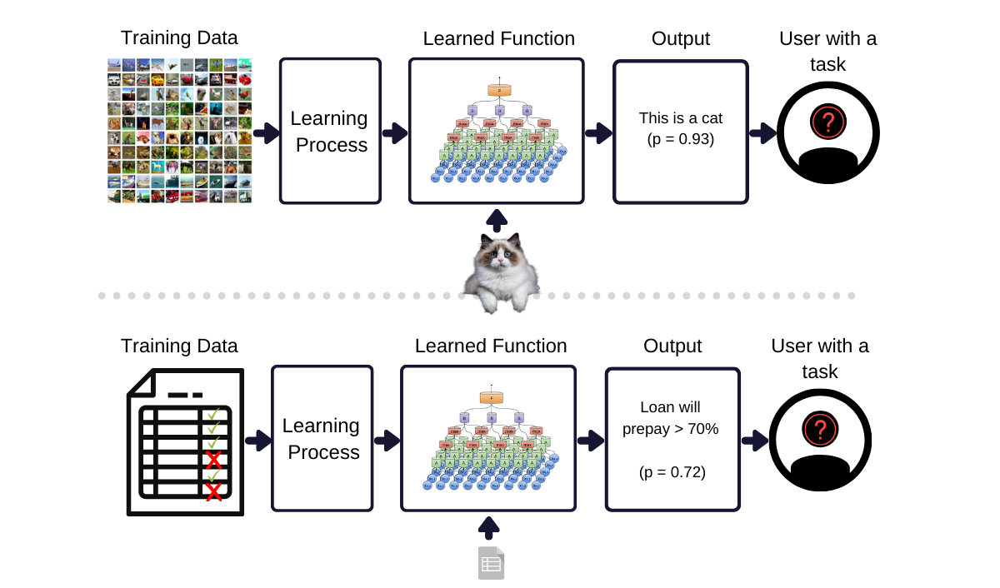

# Introduction

## Agenda

::::::{.columns}
:::{.column}

**Course Introduction**

**1.1 Overview of ML Systems**

+ When to Use ML
+ ML in Production
+ ML vs Traditional Software

**1.2 Introduction to ML System Design**

 + Business and ML Objectives
 + Requirements of Data-Driven Products
 + Iterative Process
 + Framing ML Problems 

::: 
:::{.column}

**Technical Discussion: Setting Up a Code Repository**

 + Sign up for a GitHub Account
 + Install Git.
 + Setup SSH Key.
 + Create a Repository.
 + Branching Strategies
 + Commit Messages.

:::
::::::

## Course Specifics

# Machine Learning

## ML: An Illustration

{ width=75% }

## ML: An Illustration

{ width=75% }

## What is Machine Learning (ML)?

::::::{.columns}
:::{.column}

“A computer program is said to learn from experience *E* with respect to some class of tasks *T* and performance measure *P*, if its performance at tasks in *T*, as measured by *P*, improves with experience *E*.”

(Mitchel, 1997)

:::
:::{.column}

ML is a collection of methods that allow a computer to:

+ **Learn autonomously** to perform a task based on a set of examples and without being explicitly programmed to perform the task.
+ **Gain from experience** such that the method performs better in the measure that it observes additional examples.
+ **Generalize results** beyond the data used for training the method.

:::
::::::

## Why Use Machine Learning?

::::::{.columns}
:::{.column}

+ ML is used when a task is too complex or too impractical to program explicitly.
+ When applied successfully, ML will enable:

    - Greater scale: automation.
    - Better performance.
    - Doing things that were not possible before.

:::
:::{.column}

 ([Image source](https://www.augmentedstartups.com/blog/overcoming-challenges-in-object-detection-accuracy-speed-and-scalability))

:::
::::::

## When to Use ML?

::::::{.columns}
:::{.column}

+ A business problem is not the same as a ML problem.

    - Generally, business will be concerned with profit maximization (directly or indirectly): increasing sales, cutting costs, enhance customer satisfaction, reduce churn, increase time on website, etc.
    - The objective of a ML method is to enhance performance of the task, given more data.
    - Optimising ML performance metrics does not automatically translate to optimising business performance.

+ Some of the most popular business applications of ML are in areas where business and ML performance overlap: fraud detection, recommender systems, etc.

:::
:::{.column}

"Machine learning is an approach to (1) learn (2) complex patterns from (3) existing data and use these patterns to make (4) predictions on (5) unseed data."

(Huyen, 2022)

:::
::::::

# ML System Design

## Characteristics of ML Use Cases

::::::{.columns}
:::{.column}

+ Learn: 

    - The system can learn autonomously.
    - Given a series of inputs, the system learns how to produce outputs. 
    - Not every ML model can learn any hypothesis; more complex models will tend to be more flexible.

+ Complex patterns

    - There are patterns to learn, and they are complex.
    - ML solutions are only useful if there are patterns.
    - Simple patterns could be learned, but the cost of applying ML may be unreasonable.
    

:::
:::{.column}

+ Existing data

    - Data is available , or it's possbile to collect data.
    - Out of domain predictions may fail because of lack of training data.
    - Online (real-time) learning systems could be deployed and trained using production data.

+ Predictions

    - ML algorithms will generate predictions, therefore the problem to solve should be predictive in nature.
    - A prediction could be about a future event (forecast) or an event that is difficult to observe (e.g., fraud detection or clustering).

:::
::::::

## Characteristics of ML Use Cases (cont.)

::::::{.columns}
:::{.column}

+ Unseen data
    
    - Unseen data shares pattern with the training data.
    - The learning method generalizes reasonably well on testing data.

+ It's repetitive

    - ML algorithms perform better with experience: repetitive tasks afford such experience.

:::
:::{.column}

+ The cost of wrong predictions is cheap.
    - Achieving perfect performance may not be possible.
    - Human-level performance or better could be achieved.

+ It's at scale

    - Upfront costs are involved: infrastructure, staff, DevOps.
    - Setting up an ML system caters to many ML concurrently.

+ Patterns are constantly changing

    - Hard-coded solutions can become stale and outdated.
    - The environment in which the ML system operates changes: economics, social behaviour, trends, etc.
    - Feed-back: the ML system informs a company's actions, which in turn affects interactions with the external environment.

:::
::::::

## ML Systems Design

::::::{.columns}
:::{.column}

+ ML methods are not ML systems: the learning method needs to be applied to data, assessed, tuned, deployed, governed, and so on.
+ ML system design is a system approach to MLOps, i.e., we will consider the system holistically, including:

    - Business requirements.
    - Data stack.
    - Infrastructure.
    - Deployment.
    - Monitoring.

+ MLOps:  a set of tools and best practices for bringing ML into production. 

:::
:::{.column}

:::
::::::

# How is ML in Production Different?

## ML in Research vs Production

|Dimension|Research|Production
|---------|--------|----------|
|Requirements|State-of-the-art model performance on benchmark datasets|Different stakeholders have different requirements|
|Computational priority|Fast training, high throughput|Fast inference, low latency|
|Data|Static|Constantly shifting|
|Fairness|Often not a focus|Must be considered|
|Interpretability|Often not a focus|Must be considered|

## Business and ML Objectives

::::::{.columns}
:::{.column}

+ Different stakeholders require different things:

    - ML engineers: increase performance or efficiency of recommender system.
    - Sales: recommend more profitable options.
    - Product: reduce latency.
    - Platform: stability.
    - Manager: control costs.

+ Computational priorities

    - During model development:
        
        * Training is the bottleneck.
        * Throughput, the number of cases processed, should be maximized. 

    - In production:

        * Fast inference is desireable.
        * Latency, the time between a query is received and it is addressed, should be minimized.
        * Latency is usually measured using percentiles of time elapsed (e.g., 99th percentile should be below X ms.)

:::
:::{.column}

:::
::::::

## Business and ML Objectives

::::::{.columns}
:::{.column}

+ Different stakeholders require different things:

    - ML engineers: increase performance or efficiency of recommender system.
    - Sales: recommend more profitable options.
    - Product: reduce latency.
    - Platform: stability.
    - Manager: control costs.

+ Computational priorities

    - During model development:
        
        * Training is the bottleneck.
        * Throughput, the number of cases processed, should be maximized. 

    - In production:

        * Fast inference is desireable.
        * Latency, the time between a query is received and it is addressed, should be minimized.
        * Latency is usually measured using percentiles of time elapsed (e.g., 99th percentile should be below X ms.)

:::
:::{.column}

:::
::::::

## Business and ML Objectives (cont.)

::::::{.columns}
:::{.column}

+ Data

    - Data quality.
    - Historical vs constantly generated data.

+ Fairness

    - Fair and ethical decision-making is a key requirement.
    - ML algorithms make predictions based on encodings of past observations: they can perpetuate the biases in the data and more.

:::
:::{.column}

+ Explainability

    - Trust.
    - Legal requirements.
    - Informativeness: in addition to predictions, we require feature importance and other information about or results.
    - Transferrability: can learning from a scenario be applied to other scenarios?

:::
::::::

# Requirements of ML Systems

## Lead Time to Production

## Designing Data-Intensive Applications

::::::{.columns}
:::{.column}

+ Many applications today are data-intensive, instead of compute-intensive.

    - The limit factor is data and not computation.
    - Concerns: amount of data, compleixty of data, and speed at which it changes.

+ ML Systems tend to be embedded in data-intensive applications.

(Kleppmann, 2017)

:::
:::{.column}

:::
::::::

## Fundamental Requirements of ML Systems

::::::{.columns}
:::{.column}

+ **Reliability**: The system should continue to perform the correct function at the desired level of performance even in the face of adversity.

    - May require reporting uncertainty of results.
    - Remove "silent failures": the system should alert the users of unexpected conditions.
    - If all else fails, shut down gracefully (e.g., close connections, log errors, alert downstream processes, etc.) 

+ **Scalability** to ensure possibility of growth:

    - Increase complexity.
    - Traffic volume or throughput.
    - Model count.

:::
:::{.column}

+ **Maintainability** to allow different contributors to work productively on the same system:

    - Maintain existing capacities.
    - Expand to new use cases.

+ **Adaptability** to shifting data distributions and business requirements.

    - System should allow discovering aspects for performance improvements.
    - Allow updates without service interruptions.

:::
::::::

# ML System Design: An Iterative Process

## Developing ML Systems

::::::{.columns}
:::{.column}

:::
:::{.column}

)](./img/CRISP-DM.png)

:::
::::::

## Framing ML Problems

::::::{.columns}
:::{.column}

+ The output of a ML model dictates the type of ML problem.
+ In general, there are two types of ML tasks:

    - Classification.
    - Regression.    

+ A regression model can be framed as a classification model and vice versa.
    - Regression to classification: apply quantization.
    - Classification to regression: predict likelihood of class.
    

:::
:::{.column}

+ Classification tasks are:

    - Binary: 
        * Two classes. 
        * Simplest classification problems

    - Multiclass: 
        
        * More than two (mutually exclusive) classes.
        * High cardinality (number of classes) problems will be more complex than low cardinality problems.
        * High cardinality can be addressed with a hierarchical classification approach: first, classify into large grups, then classify into specific labels.

    - Multilabel: 
    
        * An observation can have more than one label.
        * One approach is to treat the problem as multiclass by creating unique labels out of combinations of individual labels.
        * Another approach is one-vs-rest, where each label is treated with a different binary classification model.

:::
:::::::

## Objective Functions

::::::{.columns}
:::{.column}

+ ML rquires an objective function to guide the learning process through optimization. 
+ In the context of ML:

    - Regression tasks generally employ error or accuracy metrics: Root Mean Square Error (RMSE) or Mean Absolute Error (MAE).
    - Classification tasks are generally performed using log loss or cross entropy.

+ Log loss or cross-entropy loss is a performance metric that quantifies the difference between predicted and actual probabilities. 
+ In a two-class setting, it is given by:

$$
H(p, q)=-\sum_{i=1}^{n}\left(y_i log(\hat{y}_{\theta, i}) +(1-y_{i})log(1-\hat{y}_{\theta, i})\right)
$$

+ Formulation is related to maximum likelihood: minimizing negative log-likelihood is the "same" as minimizing log loss.

:::
:::{.column}

+ Assume the actual value is 1.
+ If the model is confident and correctly predicted 0.9, then `Loss = -(1*log(0.9)) = 0.10536`
+ If the model is unsure and predicted 0.5, then `Loss = -(1*log(0.5)) = 0.6931`.
+ If the model is confident but incorrectly predicted 0.1, then `Loss = -(1*log(0.1)) = 2.0258`

:::
::::::

## Decoupling Objectives

::::::{.columns}
:::{.column}

+ A product may have different (business) objectives that will be met by different models. 
+ However, each model may compete with one another for optimal results. 
+ For example, we may have the following objectives:

    - Filter out spam.
    - Filter out NSFW content.
    - Rank posts by engagement (likelihood of users clicking on it).

:::
:::{.column}

:::
::::::