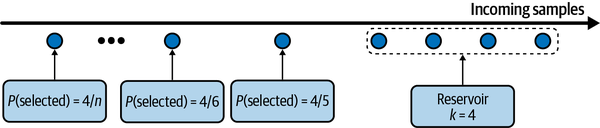
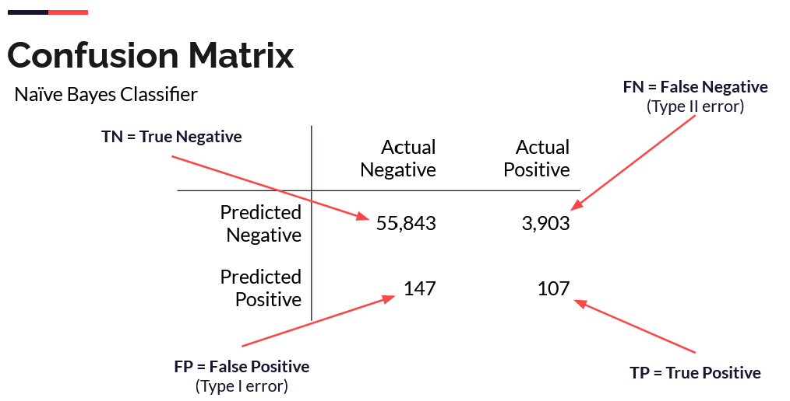
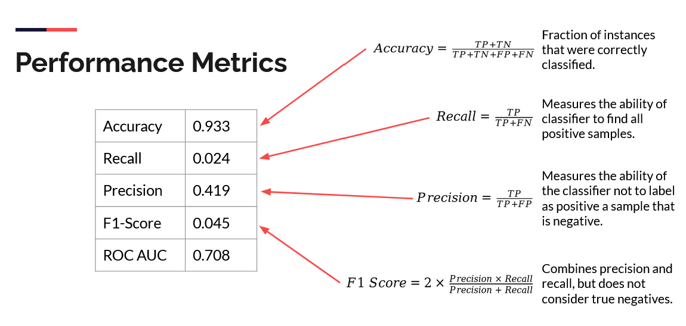

# Introduction

## Agenda

**3.1 Working with Training Data**

+ Sampling
+ Labeling
+ Class Imbalance
+ Data Augmentation

**Assignment: Setting Up a Code Repository**

+ Implement different types of sampling
+ Some recoding exercise using sci-kit learn
+ Conformal prediction?

# Sampling

## Why Sample?

::::::{.columns}
:::{.column}

+ Sampling is embedded across the ML lifecycle: data exploration, train/validation/test split, etc.
+ Sometimes, sampling is necessary:

    - We do not have access to all possible data in the real world.
    - It is unfeasible, costly, or otherwise impractical to use all data.
    - Accomplish a task faster and cheaper: experiment with a new model, explore data, etc.

:::
:::{.column}

There are two families of sampling:

+ Nonprobability sampling.
+ Random sampling.

:::
::::::

## Nonprobability Sampling

::::::{.columns}
:::{.column}

+ Generally, it is a bad idea to select data to train ML methods using this family of sampling methods, but some of them are popular.

+ Convenience sampling

    - Select data based on their availability.
    - Popular and conveninet: fast, inexpensive, practical.
    - Not scientific and does not offer guarantees.

+ Snowball sampling

    - Future samples are selected based on existing samples. 
    - Sampling in social media (or other) networks: select a base sample of accounts, then expand the sample by adding the accounts they follow, and so on.

:::
:::{.column}

+ Judgement sampling

    - Experts decide what samples to include.
    - A.K.A.: risk-based, SME, subjective, etc.

+ Quota sampling

    - Select samples based on predefined and heuristic quotas.
    - Example: select 100 responses from all age groups, without considering the proportional representation of age groups.

:::
::::::

## Random Sampling

::::::{.columns}
:::{.column}

+ Simple Random Sampling

    - All potential samples in the population have equal probabilities of being selected. 
    - Advantage: Easy to implement.
    - Disadvantage: Rare or infrequent categories of data may not appear in the selection: if a class appears in 0.01% of the data and we randomly select 1% of the population, we may not get representation of this minority class.

+ Stratified Sampling

    - First, divide the population into groups we care about, then sample from each group separately.
    - Each group is called a *stratum* and this method is called *stratified sampling*.
    - Advantage: the distribution of groups in the population is reflected in the sample.
    - Particularly important for selecting training, validation, and test sets.
    - This method is not always possible (multilabel cases, for example).

:::
:::{.column}

+ Weighted Sampling

    - Each sample is given a weight, which determines the probability of it being selected.
    - This method allows us to leverage domain exertise.
    - Can be used to adjust samples that are coming from a different distribution than the original data:

        - Assume the data contains 25% red samples and 75% blue samples. 
        - We know that the actual distribution is closer to 50% red and 50% blue.
        - We can apply red weights that are three times higher than blue weights.

:::
::::::

## Reservoir Sampling

:::::::{.columns}
:::{.column}

+ Useful for streaming data where the concept of "universe" is difficult to implement.
+ Motivation: we want samples from a Tweeter feed with equal probability.
+ Objectives: 

    - Every tweet has an equal probability of being selected.
    - You can stop the algorithm at any time and the tweets are sample with the correct probability.

+ Reservoir sampling:

    - Put the first k elements into the reservoir.
    - For each incoming nth element, generate a random number i such that 1 ≤ i ≤ n.
    - If 1 ≤ i ≤ k: replace the ith element in the reservoir with the nth element. Else, do nothing.

+ Each incoming nth element has a k/n probability of being in the reservoir.

:::
:::{.column}

:::
:::::::

# Labeling

## Hand Labels

::::::{.columns}
:::{.column}

+ Getting hand-labeled data is difficult.  
+ It is expensive, particularly, if subject matter expertise is required. For instance, compare:

    - Hand label a sentiment data set.
    - Hand label a medical diagnosis data set.

+ It may be invasive: hand labelling data requires someone to actually see the data. 
+ Hand labeling is slow.

:::
:::{.column}

+ Label ambiguity or label multiplicty occurs when there are multiple conflicting labels for a data instance.
+ Label multiplicity may occur when labels are input by multiple anotators or data comes from different sources.
+ Disagreements among anotators are common, particularly as the need for subject matter expertise increases.
+ A potential solution is to have clear problem definition and task guidance.

:::
:::::::

## Examples of Label Multiplicity

|Annotator| # entities| Annotation|
|---------|-----------|-----------|
|1| 3| [Darth Sidious], known simply as the Emperor, was a [Dark Lord of the Sith] who reigned over the galaxy as [Galactic Emperor of the First Galactic Empire].|
|2| 6| [Darth Sidious], known simply as the [Emperor], was a [Dark Lord] of the [Sith] who reigned over the galaxy as [Galactic Emperor] of the [First Galactic Empire].|
|3| 4| [Darth Sidious], known simply as the [Emperor], was a [Dark Lord of the Sith] who reigned over the galaxy as [Galactic Emperor of the First Galactic Empire].|

##  Natural Labels

::::::{.columns}
:::{.column}

+ Natural ground truth labels or natural labels occur when the system can automatically evaluate or partially predictions.
+ Examples: time traveled on a certain route on Google maps, stock return, etc.
+ Natural labels are inexpensive to obtain and motivate many ML projects.

:::
:::{.column}

+ Recommender systems are the prime example of natural labels: we will knokw if the recommendation was good, if it was acted on.
+ Many tasks can be framed as recommendation tasks, for example, predicting ads' clickthrough rate can be thought as recommending the best ads.
+ Natural labels that are inferred from user behaviours like clicks and ratings are known as behavioural labels.
+ Baehavioural labels can be:
    
    - Explicit labels are observed from user behaviour (click, upvote, rating, etc.)
    - Implict labels are inferred by non-behaviour, for example, ads that are not clicked. 

+ Inferring an implicit label depends on the deedback loop length, which is the time between serving a prediction and the feedback on it is provided.

:::
:::::

## Handling the Lack of Labels

|Method| How| Ground truths required?|
|------|----|------------------------|
|Weak supervision| Leverages (often noisy) heuristics to generate labels| No, but a small number of labels are recommended to guide the development of heuristics|
|Semi- supervision| Leverages structural assumptions to generate labels| Yes, a small number of initial labels as seeds to generate more labels|
|Transfer learning| Leverages models pretrained on another task for your new task| No for zero-shot learning. Yes for fine-tuning, though the number of ground truths required is often much smaller than what would be needed if you train the model from scratch|
|Active learning| Labels data samples that are most useful to your model| Yes|

## Weak Supervision

::::::{.columns}
:::{.column}

+ If hand labeling is costly, can we automate it?
+ Weak supervision is built on heuristics that are codified using Labeling Functions (LF):

    - Keyword heuristic.
    - Regular expressions.
    - Database lookup.
    - Outputs of other models.

+ LFs are combined, reweighted, and denoised to produce the labels.
+ In principle, no hand labels are required. In practice, a few may be required to get a sense of the accuracy of LF.

:::
:::{.column}

:::
:::::::

## Semi-Supervision

::::::{.columns}
:::{.column}

+ Leverages structural assumptions to generate new labels based on a small set of initial labels.
+ Useful when the number of labels is limited.
+ Approach 1: self-training.

    - Train a model on existing set of labeled data.
    - Make predictions for unlabeled samples, keep only the ones with high raw probability scores.4
    - Train a new model on expanded set of labels.

:::
:::{.column}

+ Approach 2: similarity.

    - Assume that data samples that share similar characteristics, share the same labels.
    - Similarity is established by more complex methods (clustering, k-nn, etc.)

+ Approach 3: perturbation.

    - Assume that small perturbations to a sample does not change its label.
    - Apply small perturbations to your training instances to obtain new training instances.

:::
::::::

# Class Imbalance

## What is Class Imblanace?

::::::{.columns}
:::{.column}

+ Class imbalance occurs when one or more classes have significantly low proportions in the data as compared to other classes.
+ The majority class dominates, but interest is generally in the minority class (e.g., default, fraud, or market crash).
+ Models trained on imbalanced data will tend to be under-fitted; they will not be able to classify the minority class successfully.
+ ML (particularly, deep learning) works well in situations when the class distribution is balanced, while performance decreases with class imbalance because:

    - There is insufficient signal for the model to learn to detect the minority class.
    - It is easier for a model to find a suboptimal solution by exploiting a simple heuristic instead of learning anything useful about the underlying pattern.
    - Asymetric costs of error.

+ Class imbalance is the norm in many subject domains.

:::
:::{.columns}

+ To handle class imbalance:

  - Choose the right performance metric.
  - Data-level methods: change the data distribution to reduce imbalance. 
  - Algorithm level methods: change learning method to make it more robust to class imbalance.
  

:::
::::::

## Performance Metrics 

::::::{.columns}
:::{.column}

:::
:::{.column}

:::
::::::

## Class Probabilities Carry Information

::::::{.columns}
:::{.column}

+ Class probabilities offer more information about model predictions than the simple class value.
+ Given class probabilities, one could decide to predict a class by comparing them to a threshold.
+ A Receiver Operating Characteristic (ROC) curve shows the relationship between the True Positive Rate (TPR) and the False Positive Rate (FPR) for a variety of thresholds.
+ A greater Area Under the ROC Curve (AUC ROC) indicates a better model: AUC ROC can be interpreted as the probability that the classifier ranks a randomly chosen positive instance above a randomly chosen negative one.
+ AUC ROC measures the ranking order of a model's prediction: it is useful when costs are unavailable and class distributions are unknown.

:::
:::{.column}

:::
::::::

## Cross-entropy, Negative Log-Loss, and Log-Likelihood

::::::{.columns}
:::{.column}

+ Log loss or cross-entropy loss is a performance metric that quantifies the difference between predicted and actual probabilities. 
+ In a two-class setting, it is given by:

$$
H(p, q)=-\sum_{i=1}^{n}\left(y_i log(\hat{y}_{\theta, i}) +(1-y_{i})log(1-\hat{y}_{\theta, i})\right)
$$
+ Formulation is related to maximum likelihood: minimizing negative log-likelihood is the "same" as minimizing log loss.

:::
:::{.column}

+ Assume the actual value is 1.
+ If the model is confident and correctly predicted 0.9, then `Loss = -(1*log(0.9)) = 0.10536`
+ If the model is unsure and predicted 0.5, then `Loss = -(1*log(0.5)) = 0.6931`.
+ If the model is confident but incorrectly predicted 0.1, then `Loss = -(1*log(0.1)) = 2.0258`

:::
:::::::

## Class Weights

::::::{.columns}
:::{.column}

+ Some models can optimize a cost or loss function that differentiates for specific type of errors.
+ In certain cases, one can assume that misclassifying minority events (false negatives) is more costly than incorrectly predicting non-events (false positives).

:::
:::{.column}

+ Relative cost or class weights can be determined by

  - Consulting a Cost Specialist or Subject Matter Expert
  - Balance function

$$
W_{y} = \frac{N_{samples}}{M_{classes}N{y}}
$$

:::
::::::

## Class Weights and Performance

::::::{.columns}
:::{.column}

:::
:::{.column}

+ Class weights (unequal costs) can affect model parameters and potentially affect model performance.
+ Not every model will be equally affected by class weight strategies.

:::
:::::::

## SMOTE

::::::{.columns}
:::{.column}

+ SMOTE: Synthetic Minority Oversampling TEchnique

  - Creates new instances based on random linear combinations of existing cases.

+ ADASYN: Adaptive Synthetic Sampling Method

  - Similar to SMOTE, but new instances are generated based on density.

+ With the availability of conformal prediction and advanced ML methods, synthetic oversampling is challenging to justify.

:::
:::{.column}

 ](./img/smote2.png)

:::
:::::::

