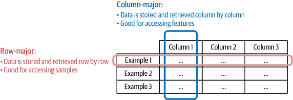
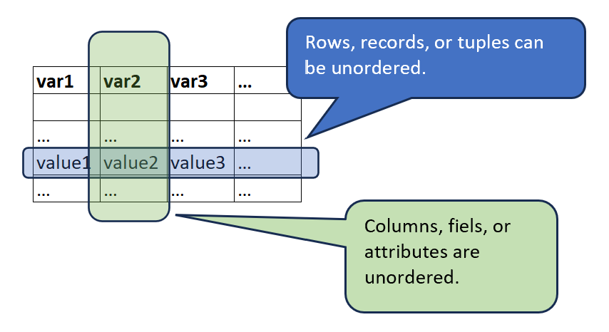

# Introduction

## Agenda

::::::{.columns}
:::{.column}

**2.1 Data Engineering Fundamentals**
	
+ Data Sources
+ Data Formats  
+ Data Models 
+ Data Storage and Processing
	
:::
:::{.column}


**Technical: Setting Up a Code Repository**

+ Download large data set
+ Setup virtual environments
+ Write code to load it in dask
+ Write code to write parquet files in dask
+ Naming convention

:::
::::::

# Data Sources

## Why Now?

::::::{.columns}
:::{.column}


:::
:::{.column}


:::
::::::

## Data Sources

::::::{.columns}
:::{.column}

+ Different data sources have different characteristics.
+ User input data:

    - Data that is explicitly input by users.
    - Text, images, videos, files, etc.
    - Prone to error: text too long, too short, incomplete, unexpected data types, etc.

+ System generated data:

    - Logs, performance metrics, and other system outputs.
    - Generally, well-formatted.
    - Can grow rapidly.


:::
:::{.column}

+ Databases generated by (internal) services and enterprise applications:

    - Many times, structured data.
    - Varying degrees of data quality.

+ Third-party data:

    - Data collected from the public, when the public is not a customer of the collecting organization.
    - Price databases, news aggregators, etc.


:::
::::::

# Data Formats

## Data Formats

::::::{.columns}
:::{.column}

+ Data storage is a fundamental component in any ML system:

    - Store raw input data. 
    - Store pre-computed features. 
    - Store model performance metrics and other model-related information.
    - Store logs for monitoring and debugging.

+ Multiple storage types can be combined with data transformation proceudres to create *pipelines*.


:::
:::{.column}

+ Selecting the right data format for storing can be beneficial in terms of performance and costs. 
+ *Data serialization* is the process of converting a data structure or object state into a format that can be stored or transmitted and reconstructed later.
+ Data formats can be:
    - Text or binary-based. 
    - Human readable. 
    - Row-major or column-major.

:::
::::::


## Some Common Data Formats

|Format |Binary/Text    |Human-readable |Example use cases|
|-------|---------------|---------------|-----------------|
|JSON   |Text           |Yes            |Everywhere|
|CSV    |Text           |Yes            |Everywhere|
|Parquet|Binary         |No             |Hadoop, Amazon Redshift|
|Avro   |Binary primary |No             |Hadoop|
|Protobuf|Binary primary|No             |Google, TensorFlow (TFRecord)|
|Pickle |Binary         |No             |Python, PyTorch serialization|


## JSON

::::::{.columns}
:::{.column}

+ JavaScript Object Notation.
+ Human-readable.
+ Implements a key-value pair paradigm that can handle different levels of structured-ness.
+ A popular format.

:::
:::{.column}

)](./img/json_object.png)

:::
::::::


## JSON is Flexible

::::::{.columns}
:::{.column}

Consider the record below. 

```
{
  "firstName": "Boatie",
  "lastName": "McBoatFace",
  "isVibing": true,
  "age": 12,
  "address": {
    "streetAddress": "12 Ocean Drive",
    "city": "Port Royal",
    "postalCode": "10021-3100"
  }
}
```
:::
:::{.column}

The data can also be represented with less structure.

```
{
  "text": "Boatie McBoatFace, aged 12, is vibing, at 12 Ocean Drive, Port Royal, 
           10021-3100"
}
```
:::
::::::

## Row-Major vs Column-Major Formats

::::::{.columns}
:::{.column}

**Row-Major Format**

+ Consecutive elements in a row are stored next to each other.
+ Example: CSV (Comma-Separated Values in a text file).
+ Accessing rows will tend to be faster than accessing columns.
+ Faster for writing additional records. 


:::
:::{.column}

**Column-Major Format**

+ Consecutive elements in a column are stored next to each other.
+ Example: parquet.
+ Accessing columns will tend to be faster than accessing columns.
+ Faster for retrieving columns.

:::
::::::

## Row-Major vs Column-Major (Huyen, 2022)





## Text vs Binary Formats

::::::{.columns}
:::{.column}

+ CSV and JSON files are stored as text files and are usually human-readable. 
+ Non-text file formats are called *binary*.

:::
:::{.column}

+ Binary files are more compact:

    - To store the number 1000000 would require 7 characters or 7 bytes (at 1 character per byte).
    - To store 1000000 as int32 would require 32 bits or 4 bytes.

:::
::::::

# Data Models

## Relational Model

::::::{.columns}
:::{.column}



:::
:::{.column}

+ Invented by Edgar F. Codd in 1970 in "A Relational Model of Data for Large Shared Data Banks"
+ Data is organized into relations.
+ Each relation is a set of tuples.
+ A table is a visual representation of a relation: each relation is a set of tuples.
+ Relations are unordered: we can shuffle rows or columns while retaining the relation.
+ Data following the relational model are usually stored using CSV, parquet, and (some types of) databases.

:::
::::::

## Normalization

::::::{.columns}
:::{.column}


:::
:::{.column}

+ Normalization is the process of determining how much redundancy exists in a table and reducing it, as required. 
+ The goals of normalization are to:

    - Be able to characterize the level of redundancy in a relational schema.
    - Provide mechanisms for transforming schemas in order to remove redundancy

+ Generally, we want to minimize redundancy of primamry and foreign keys.


:::
:::::::


# Data Storage and Processing

